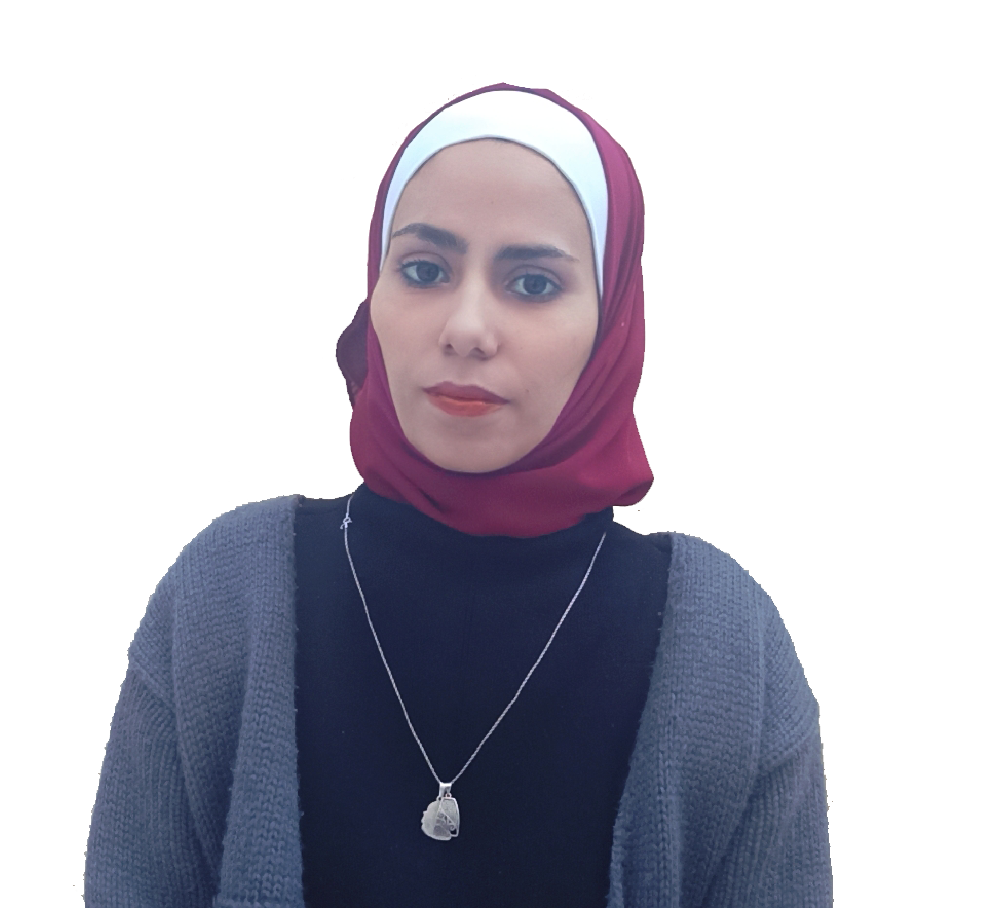

# htmlcsstask
### Hi there 👋, my name is Ro'a yaseen
#### I am trainee at Orange Programming Academy
![I am trainee at Orange Programming Academy]

In this project I put all my effort and time during a month and I will also puted all  after 5 months as well, so everything inside was done with love

Skills:  REACT / JS / HTML / CSS/PHP/Laravel 

- 🔭 I’m currently working on this page. 

        

